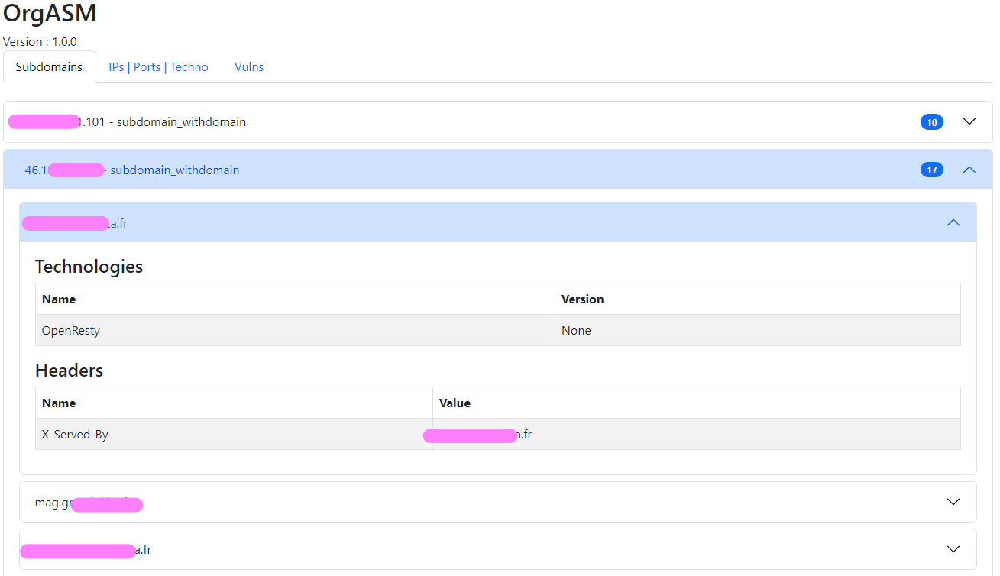
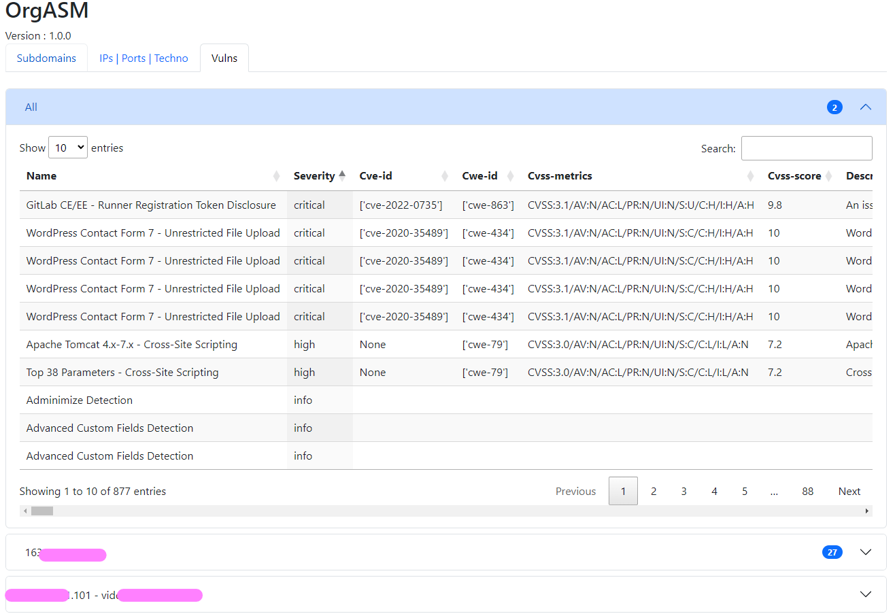

<p align="center"> </p>

[](https://github.com/ugomeguerditchian/OrgASM)


<h2 align="center">OrgASM</h2>

A tool for Organized ASM (Attack Surface Monitoring).

OrgASM can detect subdomains, detect all ip related to them, scan all open ports and detect services and vulnerabilities.

With the power of multi-threading it can be as fast as you want (and has you can) 🚀

In the very next future it will be shodan and censys friendly 🙌

We will also soon released the dorking compatibility and web parser 🥸

## Features
- Can scan a domain, a network or a list of IPs
- Can be limited to a given scope (domain or subdomains given in a file)
- Obtaining results via [Alienvault](https://otx.alienvault.com/), [Hackertarget](https://hackertarget.com/) and [crt.sh](https://crt.sh/)
- Web, JSON and TXT export
- Possibility to add a list of already knows subdomains
- Subdomain Bruteforcing
- Vulnerability detection with [nuclei](https://github.com/projectdiscovery/nuclei)
- Recursive scan
- IP Sorting and scanning (Ports and services)
- OrgASM can detect services using Wappalyzer sources ! Thanks to [webtech](https://github.com/ShielderSec/webtech)
- Harvesting of headers
- Filtering real subdomains by access them (and detect potential redirections to others subdomains).
- You can choose if you want only OSINT mode (API request on third party websites), Bruteforce and IPs scanning

## Installation

Install **OrgASM** with pip
(:warning: *Python 3.8 >= Needed*)

```
  git clone https://github.com/ugomeguerditchian/OrgASM
  cd OrgASM
  pip install -r requirements.txt
  usage: main.py [-h] [-d DOMAIN] [-ip IP] [-net NETWORK] [-m MODE] [-sF SUBFILE] [-ipF IPFILE] [-R RECURSIVE] [-w WORDLIST] [-wT WORDLISTTHREADS] [-iS IPSCANTYPE] [-iT IPTHREADS] [-sT SUBDOMAINSTHREADS]
               [-cP CHECKPORTSTHREADS] [-dT DETECTTECHNO] [-vuln] [-vulnconf VULNCONFIG] [-limit]

  options:
    -h, --help            show this help message and exit
    -d DOMAIN, --domain DOMAIN
                          Domain to scan
    -ip IP, --ip IP       IP to scan
    -net NETWORK, --network NETWORK
                          Network to scan, don't forget the CIDR (ex: 192.168.1.0/24)
    -m MODE, --mode MODE  Mode to use, O for OSINT (API request), B for bruteforce, S for IP scan (default OBS)
    -sF SUBFILE, --subfile SUBFILE
                          Path to file with subdomains, one per line
    -ipF IPFILE, --ipfile IPFILE
                          Path to file with IPs, one per line
    -R RECURSIVE, --recursive RECURSIVE
                          Recursive scan, will rescan all the subdomains finds and go deeper as you want, default is 0
    -w WORDLIST, --wordlist WORDLIST
                          Wordlist to use (small, medium(default), big)
    -wT WORDLISTTHREADS, --wordlistThreads WORDLISTTHREADS
                          Number of threads to use for Wordlist(default 500)
    -iS IPSCANTYPE, --IPScanType IPSCANTYPE
                          Choose what IPs to scan (W: only subdomains IP containing domain given, WR: only subdomains IP containtaining domain given but with a redirect, A: All subdomains detected
    -iT IPTHREADS, --IPthreads IPTHREADS
                          Number of threads to use for IP scan(default 2000)
    -sT SUBDOMAINSTHREADS, --subdomainsThreads SUBDOMAINSTHREADS
                          Number of threads to use for check real subdomains(default 500)
    -cP CHECKPORTSTHREADS, --checkPortsThreads CHECKPORTSTHREADS
                          Check all ports of subdomains for all IP in IPScantype (-iS) and try to access them to check if it's a webport (default True) (deactivate with 0)
    -dT DETECTTECHNO, --detectTechno DETECTTECHNO
                          Detect techno used by subdomains (default True) (deactivate with False)
    -vuln, --vulnScan     Scan subdomains using Nuclei, you need to have nuclei installed and in your PATH (default False)
    -vulnconf VULNCONFIG, --vulnConfig VULNCONFIG
                          Path to config file for nuclei (default is the default config)
    -limit, --limit       Limit the scope of scan to the domain given or the subdomains given in the file (-sF) (default False)
```

> :memo: **Note:** help with `python main.py -h`

## Web Exports Exemple for the commands : python main.py -d domain.fr -vuln

Subdomains tab :


IPs | Ports | Techno tab :


Vulnerabilities tab :


## Usecases

- Map surface attack from a domain :
```
python main.py -d domain.fr
```
- Scan an IP :
```
python main.py -ip 1.1.1.1
```
- Scan a network :
```
python main.py -net 192.168.1.0/24
```
- Scan multiple IPs :
```
python main.py -ipF /path/to/ips.txt
```


- Map surface attack from a domain and scan for vulnerabilities :
```
python main.py -d domain.fr -vuln
```
- Map surface attack from a domain and scan for vulnerabilities with a custom config file :
```
python main.py -d domain.fr -vuln -vulnconf /path/to/config.yaml
```
- Map surface attack from a domain and scan for vulnerabilities and limit the scope to the domain given :
```
python main.py -d domain.fr -vuln -limit
```
- Map surface attack from a domain and scan for vulnerabilities and limit the scope to the subdomains given in the file (-sF) :
```
python main.py -d domain.fr -vuln -sF /path/to/subdomains.txt
```


## Roadmap

- [X] Service scanning amelioration
- [x] Added Web GUI !
- [ ] Add DNS transfer zone test
- [X] Recursive scan for subdomains bruteforcing
- [ ] Selection of others API websites like shodan, censys etc... (need to have an api key)
- [X] Filtering real subdomains by access them (and detect potential redirections to others subdomains)
- [ ] Dorking test
- [ ] Export map options
- [X] Possibility to add a list of already knows subdomains
- [X] Choice for doing only API scan, Bruteforce scan or IP scan (or all)
- [ ] Config file (yaml)
- [X] Choice for doing IP scan only on target associated with main domain
- [X] Add vulnerability scan
## Authors

- [@ugomeguerditchian](https://github.com/ugomeguerditchian)

## Contributors

- [@MrStaf](https://github.com/MrStaf)
